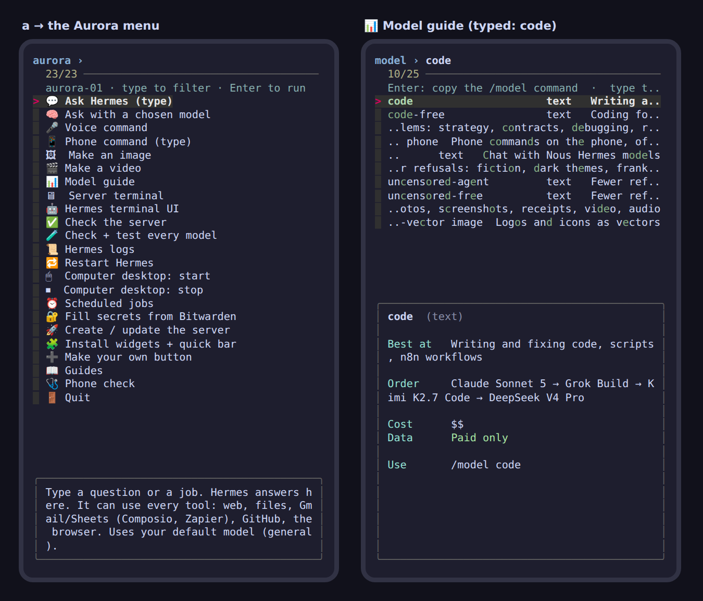

# How it all works: voice, text, pictures, and what goes where

This is the "how do I use it" guide. **Setting it up** is [SETUP.md](./SETUP.md) (and the
short version is at the end of this page). **What's installed where** is
[INVENTORY.md](./INVENTORY.md).

## The big picture

```
 YOUR PHONES (Reno 11, S10)                THE SERVER (Hostinger, Jakarta)            PROVIDERS
 ─────────────────────────                 ───────────────────────────────            ─────────
 Telegram / WhatsApp / Discord / Slack ──▶ Hermes (the agent, 24/7) ──▶ LiteLLM router ──▶ Claude, GPT,
   typed text, voice notes, photos          · Whisper (voice → text)     picks the model    Gemini, Grok,
                                            · tools: web, files, shell   per job, with      DeepSeek, Kimi,
 Termux  ── `a` menu / widgets ──SSH──▶     · MCP: Composio, Zapier,     fallbacks          free models …
   │        (over Tailscale)                  GitHub, Playwright …                         (OpenRouter,
   │                                        · image_gen / video_gen ─────────────────────▶  Anthropic, HF)
   └─ Needle (on the phone, offline):       n8n, dashboards, computer-use desktop
      torch, volume, battery, clipboard…    (private: only reachable over Tailscale)
```

Three rules explain almost everything:

1. **Hermes is the brain, and it lives on the server.** Whatever you use to talk to it
   (Telegram, the `a` menu, a widget), the thinking happens on the server.
2. **The router picks the model.** Hermes asks for a *job* (`general`, `code`,
   `vision`…), and the router tries the best model for that job first, then falls
   back. Anything with client details stays on paid models.
3. **Needle only does phone things, on the phone.** "Torch on" never leaves the phone.
   Anything that isn't a phone command goes to Hermes.

---

## 💬 Text

**From anywhere (easiest): Telegram.** Message your bot like a person:
*"Draft a reply to Ben's email about the gutter quote"*, *"What's on my calendar
tomorrow?"*, *"Add a row to my Leads sheet: Sarah, 0412…, re-roof, Carindale"*.

What happens:

1. Telegram passes the message to **Hermes** (it only answers your own account; the
   allowlist is in `stacks/hermes/data/.env`).
2. Hermes asks the router for its current model (default `general`: Claude Sonnet 5,
   falling back to GPT-5.6, Kimi, then DeepSeek).
3. If the job needs a tool, Hermes uses it: web search, Gmail/Sheets through Composio
   or Zapier, GitHub, the browser (Playwright), its shell, n8n.
4. The answer comes back in the chat.

**Change the model for this chat:** `/model code`, `/model free`, `/model reason`,
`/model uncensored`… Not sure which? On the phone: `a` → **📊 Model guide** (type to
filter; Enter copies the `/model` command so you can paste it).

**From Termux:** `a` → **💬 Ask Hermes**, or straight from the shell:

```sh
aurora-ask "summarise yesterday's leads"
aurora-ask -m code "why does my n8n webhook return 404?"
```

The question travels over SSH (inside Tailscale) to the same Hermes.

## 🎤 Voice

There are two voice paths, for two kinds of request.

**1. Voice notes in Telegram (or WhatsApp): for anything you'd type.**
Hold the mic, talk, send.

- The audio goes to the server. **Whisper on the server** turns it into text (free, and
  the audio never leaves your server).
- From there it's exactly the **Text** flow above.
- Want the answer spoken back? Send `/voice tts` once. Replies then come as voice bubbles
  (free Australian Edge voice; change it under `tts:` in the Hermes config).

**2. The 🎤 Voice button on your phone: for phone commands, and quick questions.**
It's on the home-screen widget, the pinned "Aurora" notification, and in the `a` menu.

- Android's own speech-to-text turns what you say into text, on the phone.
- **Needle** (a 35 MB model that runs on the phone, offline, in about a quarter of a
  second) checks whether it's a phone command:

  | You say | What happens | Where |
  |---|---|---|
  | "torch on", "volume 5", "make the screen brighter", "vibrate for 2 seconds" | done instantly | phone only |
  | "how much battery have I got", "where am I", "what's my wifi" | read out to you | phone only |
  | "copy 'gutter quote 450' to the clipboard", "open ymiroofing.com.au", "say 'job done' out loud" | done | phone only |
  | "write a quote email for Ben", "what's the weather tomorrow", "remind me at 3" | sent to **Hermes**; the answer is **read out** | server |

- Needle is small and can be confidently wrong on open questions ("write me a poem"
  once came back as a clipboard action at 93% confidence in testing). So a request only
  reaches Needle if it contains a phone word, Needle has to be at least 85% sure with
  every value taken from what you said, and anything else goes to Hermes.

## 🖼 Pictures

**Show it a picture:** send a photo in Telegram with a question: *"What's wrong with this
flashing?"*, *"Read this receipt and add it to my expenses sheet"*. Hermes uses the
`vision` chain (Gemini 3.8 Flash first) to look at it, then carries on like a text
request.

**Make a picture:** *"Make an image of a terracotta tile roof at sunset, photo style"*.

- Hermes' image tool calls OpenRouter. The default is Seedream 4.5 (~4¢ an image).
- The picture comes back in the chat, and a copy stays on the server in
  `stacks/hermes/data/cache/images/`.
- Want a particular model? Say so: *"…use gpt-image-2.5-flare"* is best for text and
  logos, *"…use flux.2-klein-4b"* is the cheapest. Prices are in the model guide.

**Edit your photo:** send the photo plus *"make the roof dark grey"* (Gemini Flash Image
is good at edits).

**From the phone without Telegram:** the **🖼 Make image** widget (or `a` → Make an image,
or `aurora-gen image "…"`). You describe it, Hermes makes it on the server, and it's
copied into **Pictures/Aurora** and opened.

## 🎬 Video

*"Make a 6 second video of a drone rising over a new Colorbond roof"*. It takes 1 to 10
minutes, and Hermes sends it when done. The default is Veo 3.1 Lite: 3–8¢ per second,
with sound. Other options, cheapest first: Grok Imagine (5–7¢/s), Kling 3.0 (8–13¢/s),
Veo 3.1 (20–40¢/s) and Sora 2 Pro (30–50¢/s). From the phone: `a` → **🎬 Make a video**,
or `aurora-gen video "…" --seconds 6`. It lands in **Movies/Aurora**.

---

## What goes where (and who sees it)

| What you send | Goes to | Who can see it |
|---|---|---|
| Phone commands (torch, volume…) | stays on the phone (Needle + Termux:API) | nobody |
| Voice notes | your server (Whisper) → then the text follows the row below | your server |
| Messages on `general`, `code`, `reason`, `fast`, `vision`, `search`, `research` | a **paid** provider (Anthropic, OpenAI, Google, xAI, DeepSeek, Moonshot, Perplexity) | that provider, under its paid API terms (check each one's data policy for client work) |
| Messages on `free`, `code-free` | **free** OpenRouter models | may be logged or used for training. **Never client details.** |
| Messages on `uncensored*` | small paid or local models | **never client details** |
| Pictures and videos you make | OpenRouter → the image/video model | that provider |
| App actions (Gmail, Sheets, Notion…) | Composio or Zapier → the app | those services + the app |
| Your passwords | your Bitwarden vault, unlocked on the phone only when needed | nobody else; the server never gets your vault |
| Server keys (API keys) | `secrets.env` on the server (mode 600), or a Bitwarden Secrets Manager project | the server |

---

## Which model for which job

Open it on the phone: **`a` → 📊 Model guide** (or `aurora-models --print`). The short
version:

| Job | `/model …` | Cost |
|---|---|---|
| Everyday, client work | `general` (default) | $$ |
| Everyday, private-free | `free` | $0 |
| Code | `code` / `code-free` | $$ / $0 |
| Hard thinking | `reason` | $$$ |
| Bulk and cheap | `fast` | $ |
| Photos and screenshots | `vision` | $ |
| Current facts | `search` / `research` | $$ / $$$ |
| Fewer refusals | `uncensored` (with tools), `uncensored-free` ($0, on the server) | $ / $0 |

Uncensored models at every price are listed in
[stacks/router/README.md](./stacks/router/README.md#uncensored-models-by-price).

---

## The phone kit

Type **`a`** in Termux, or tap **Aurora menu** on the home-screen widget, for one menu
of everything:



| Where | What you get |
|---|---|
| `a` (Termux, Termux:Float, or over SSH) | the menu: ask, voice, phone command, image, video, model guide, server terminal, Hermes TUI, checks, logs, restart, desktop on/off, scheduled jobs, Bitwarden, create the server, widgets, guides, phone check |
| Home-screen buttons (Termux:Widget) | Aurora menu · Ask Hermes · Model guide · Box check |
| Silent buttons (no terminal) | 🎤 Voice command · 🖼 Make image · Ask (answer as a notification) · Box status |
| Pinned notification (starts at boot) | **🎤 Voice · 💬 Ask · 📋 Status** buttons, over any app |
| Termux:Float | a floating terminal over any app. Type `a` in it for the menu |

**Make your own button:** `aurora-widgets new torch-on 'aurora-needle "turn on the torch"' --task`
(or `a` → **➕ Make your own button**). Add `--boot` to run a command at every phone start.

## Needle, in detail

- **Install:** `aurora-kit needle` downloads the Android build (~37 MB) from Cactus
  Compute's Hugging Face page and tests it. Telemetry is switched off
  (`NEEDLE_TELEMETRY=0`, `DO_NOT_TRACK=1`).
- **Use:** `aurora-needle "torch on"`, `aurora-needle --voice`, or the 🎤 buttons.
  `aurora-needle --dry-run "…"` shows what it would do without doing it.
- **What it can do:** battery, location, torch, speak text, notification, volume,
  brightness, vibrate, clipboard, open a website, Wi-Fi info. The tool list is
  `phones/kit/data/needle-tools.json`. Add a tool there, then map it to a Termux:API
  command in `phones/kit/bin/aurora-needle`.
- **Tuning:** `AURORA_NEEDLE_MIN=0.9` makes it stricter; the phone-word list is at the
  top of the script.
- **Tested:** 15 sample requests on the same model file the phone uses. Phone commands
  ran on-device; open questions went to Hermes.

## Hermes, in detail

Everything Hermes can do, and what's switched on here, is in
[stacks/hermes/FEATURES.md](./stacks/hermes/FEATURES.md). The chat commands you'll use
most:

| Send | Does |
|---|---|
| `/model <job>` | switch the model for this chat |
| `/goal <outcome>` | keep working until it's done (a judge checks after each step) |
| `/loop 30m <task>` | repeat every 30 minutes |
| `/cron add "0 21 * * *" "<task>" --deliver telegram` | a scheduled job (times are UTC: 21:00 UTC = 7 am Brisbane) |
| `/voice tts` | spoken replies on/off |
| `/yolo` | no approval prompts in this chat (see the warning in the Hermes README) |
| `/new` · `/compress` | fresh chat · shrink a long one |
| `/curator status` | the skill librarian |

**Long background jobs** (the "40 mins?" question): yes. On the server Hermes keeps
working as long as the task is making progress. It only gives up after **2 hours with no
activity**, and it can run commands in the background and check on them. `/goal`,
`/loop` and `/cron` keep going for days, and they survive reboots. Your phone doesn't
need to stay connected.

## Bitwarden

- **On the phone** (`bw`, installed with `aurora-kit bitwarden`):
  1. In Bitwarden, make a folder called **Aurora**.
  2. Add one item per key: name = the variable (e.g. `OPENROUTER_API_KEY`), value in the
     password (or notes).
  3. Run `aurora-secrets check`. It lists what's there without showing values.
  4. Run `aurora-secrets fill`. It writes `infra/secrets.env` (mode 600), keeps the
     template's defaults for anything missing, and locks the vault again.
- **On the server (optional):** Bitwarden **Secrets Manager** gives the server its own
  project of keys (a "machine account"), so your personal vault never goes near it:
  `docker exec -it hermes hermes secrets bitwarden setup`. That needs the free Secrets
  Manager plan, which is separate from your personal vault.

---

## Set up the server from your phone (the short version)

The full, checked list is [SETUP.md](./SETUP.md). From the Reno 11, in Termux:

```sh
# 1. Phone kit (menu, Needle, widgets): part of the phone setup, or on its own
bash ~/aurora/infra/phones/kit/bin/aurora-kit install
aurora-kit bitwarden                 # optional: the Bitwarden CLI

# 2. Keys: from Bitwarden, or edit by hand
aurora-secrets fill                  # or: cp secrets.env.example secrets.env && nano secrets.env
                                     # needs at least HOSTINGER_API_TOKEN, OPENROUTER_API_KEY, TELEGRAM_BOT_TOKEN

# 3. Create the server (shows the live price first; refuses anything over AUD $39/mo)
cd ~/aurora/infra && ./bootstrap.sh --dry-run && ./bootstrap.sh
#    or: a → 🚀 Create / update the server

# 4. Start the stacks on it: SETUP.md §6 (router → n8n → Hermes → Tailscale → monitoring → computer)
ssh aurora@<IP>

# 5. Confirm everything
bash /opt/aurora/check.sh --live     # or: a → 🧪 Check + test every model
```

Then message your Telegram bot "hi".
