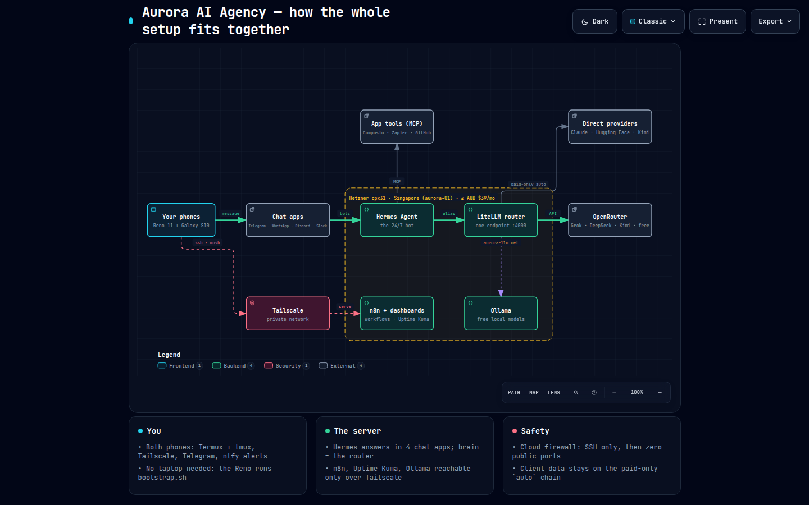
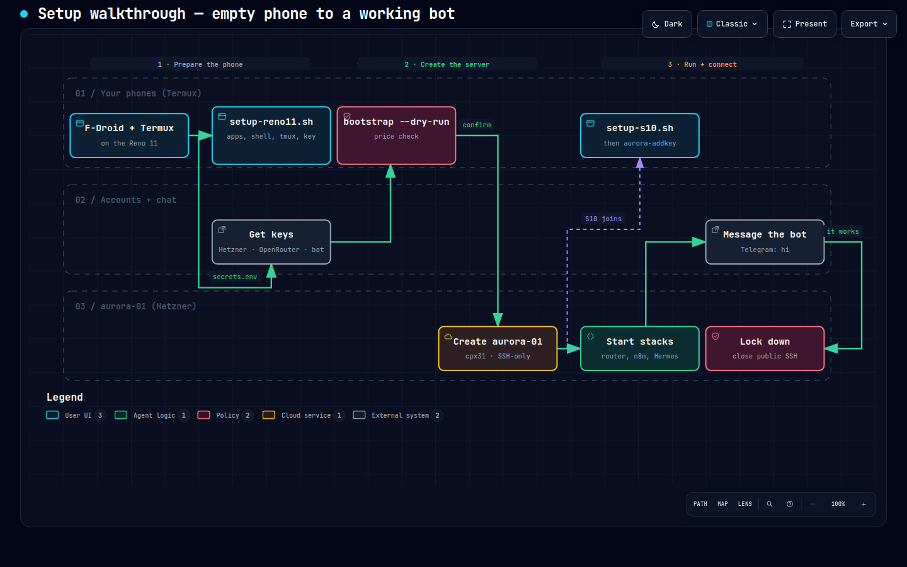
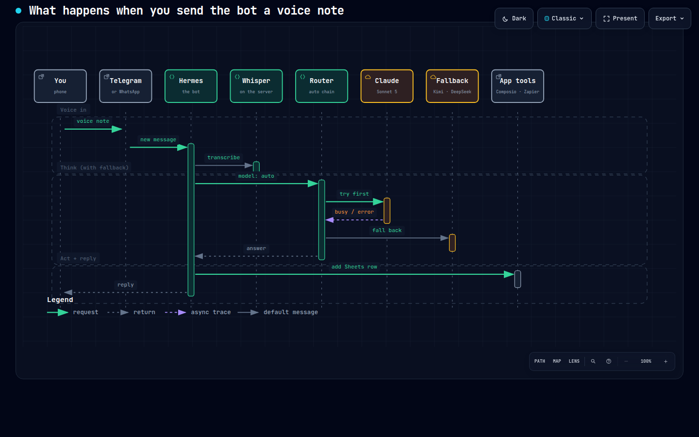

# Visual guide — the whole setup in three pictures

Three diagrams, made with the [Archify](https://github.com/tt-a1i/archify) skill. Each one:

- is a **picture** here (dark and light, in [`diagrams/png/`](./diagrams/png/)), and
- is an **interactive page** in [`diagrams/`](./diagrams/) (`*.html`: zoom, search, click a box to
  highlight its connections, dark/light switch, **Present** mode, and **Export** to
  PNG/SVG/WebP). Download it and open it in any browser, including on your phone.

All three passed Archify's strictest ("showcase") checks: no crossing lines, no overlapping
labels, text large enough to read on a laptop. They also passed a real-browser check at four
screen sizes (receipts in [`diagrams/receipts/`](./diagrams/receipts/)). The source of each
diagram is the small `*.json` file next to it. Edit that and re-render; don't edit the HTML.

---

## 1. How everything fits together



<sub>[Light version](./diagrams/png/system-light.png) · [interactive](./diagrams/system.html) · [source](./diagrams/system.architecture.json)</sub>

**Read it left to right (the green arrows are the main path):**

1. **Your phones** (Reno 11 + S10): Termux + tmux for control, and the chat apps for talking.
2. **Chat apps**: Telegram, WhatsApp, Discord or Slack. The bot connects *out* to them, so
   the server needs no open ports.
3. **Hermes Agent**, the 24/7 bot on the server. Voice notes are turned into text by Whisper
   on the server itself.
4. **LiteLLM router**: one endpoint that picks the model. `/model code`, `/model free`,
   `/model search` and so on switch chains.
5. **OpenRouter**: Grok Build, DeepSeek, Kimi, Qwen, Perplexity, the free models, the
   uncensored ones.

**Side paths:**
- **Up from the router → Direct providers** (Claude, Hugging Face, Kimi): the paid-only
  `general` chain (older name `auto`) for anything with client data.
- **Up from Hermes → App tools**: Composio, Zapier and GitHub over MCP. This is how the bot
  actually *does* things (Sheets rows, emails, issues).
- **Down from the router → Ollama** (dashed): free local models, including the uncensored
  ones, over a private Docker network.
- **Your phones → Tailscale → n8n + dashboards** (red dashes = security path): private access
  to n8n, Uptime Kuma and the router UI. Nothing is public.

The yellow box is the server, capped at AUD $39/month. The diagram shows the original Hetzner
cpx31 plan; the box is now a **Hostinger KVM 2 in Jakarta** (same software, same diagram).

---

## 2. Setup walkthrough: empty phone to a working bot



<sub>[Light version](./diagrams/png/walkthrough-light.png) · [interactive](./diagrams/walkthrough.html) · [source](./diagrams/walkthrough.workflow.json)</sub>

Three columns = three phases. Three rows = where each step happens.

| # | Step | Where | Guide |
|---|---|---|---|
| 1 | **F-Droid + Termux** on the Reno 11 | phone | [phones/README.md](../phones/README.md) → Quick start |
| 2 | **`setup-reno11.sh`**: apps, smart shell, tmux, SSH key (resumable) | phone | same |
| 3 | **Get keys** into `secrets.env`: Hostinger token, OpenRouter, Telegram bot | accounts | [SETUP.md](../SETUP.md) §1–3 |
| 4 | **`bootstrap.sh --dry-run`**: shows the live price and refuses anything over AUD $39 | phone | SETUP.md §1 |
| 5 | **Create aurora-01** (confirm with `buy`): Hostinger KVM 2 with an SSH + Tailscale firewall | server | SETUP.md §1 |
| 6 | **Start the stacks**: router → n8n → Hermes → Tailscale | server | SETUP.md §6 |
| 7 | **Message the bot**: "hi" on Telegram | chat | SETUP.md §7 |
| 8 | **Lock down**: close public SSH once Tailscale works | server | SETUP.md §8 |
| ↳ | **S10 joins** (purple dashes): `setup-s10.sh`, then `aurora-addkey` on the Reno | phone | [phones/S10.md](../phones/S10.md) |

---

## 3. What happens when you send a voice note



<sub>[Light version](./diagrams/png/message-light.png) · [interactive](./diagrams/message.html) · [source](./diagrams/message.sequence.json)</sub>

Time runs **top to bottom**. The tall bars show who's busy.

**Voice in**
1. You send a **voice note** in Telegram (or WhatsApp).
2. Telegram passes it to **Hermes** as a new message.
3. Hermes has **Whisper transcribe** it, on your own server: free, and the audio never
   leaves it.

**Think (with fallback)**
4. Hermes asks the **router** for its default chain (`general`; the diagram's `auto` is the
   same chain under its older name).
5. The router **tries Claude first**.
6. If Claude is **busy or errors** (purple dashes)…
7. …the router **falls back** automatically: GPT-5.6, then Kimi, then DeepSeek. `general` never falls to a
   free model, so client details stay on paid providers.
8. The **answer** comes back to Hermes.

**Act + reply**
9. If the request needs an action, Hermes uses an **app tool** (Composio / Zapier), e.g.
   "add a row to my Leads sheet". The first time, that app asks you once for permission.
10. Hermes sends you the **reply**.

---

## Updating the diagrams

When the setup changes, edit the `*.json` next to the picture, then (with Node 22 and the
Archify skill installed: `npx skills add tt-a1i/archify -g`):

```sh
node <archify>/bin/archify.mjs validate architecture diagrams/system.architecture.json --quality showcase
node <archify>/bin/archify.mjs deliver  architecture diagrams/system.architecture.json diagrams/system.html --quality showcase
```

Use `workflow` / `sequence` for the other two. A new PNG comes from the page's **Export**
button, or from `archify visual-check` (writes screenshots; set `ARCHIFY_CHROME` to a
Chrome/Chromium binary).
